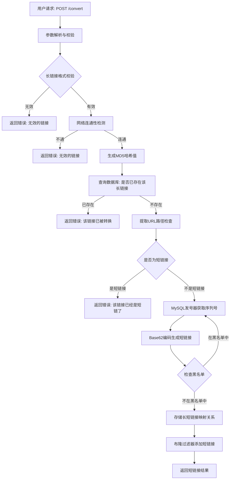
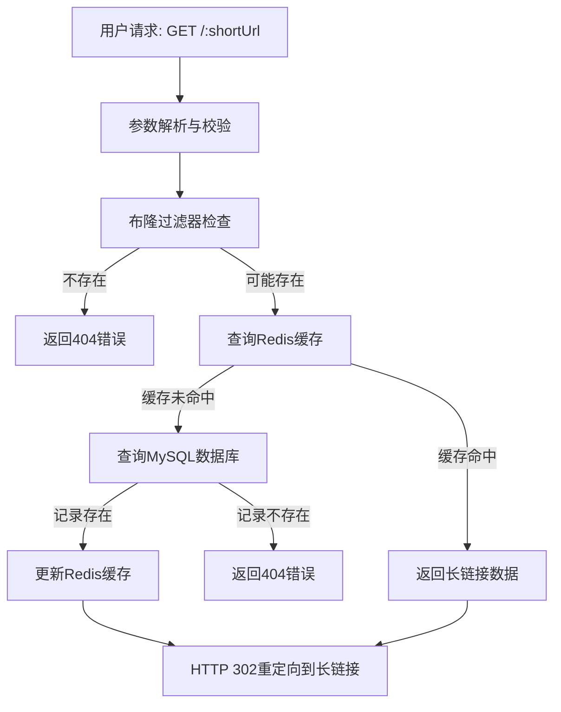
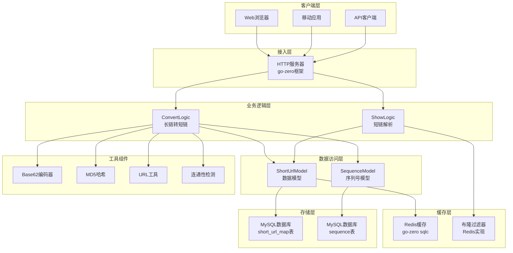

# 短链接项目

## 搭建项目的骨架

1. 建库建表

新建发号器表
```sql
CREATE TABLE `sequence` (
 `id` bigint(20) unsigned NOT NULL AUTO_INCREMENT,
 `stub` varchar(1) NOT NULL,
 `timestamp` timestamp NOT NULL DEFAULT CURRENT_TIMESTAMP ON UPDATE CURRENT_TIMESTAMP,
 PRIMARY KEY (`id`),
 UNIQUE KEY `idx_uniq_stub` (`stub`)
) ENGINE=MyISAM DEFAULT CHARSET=utf8 COMMENT = '序号表';
```

新建长短链映射表
```sql
CREATE TABLE `short_url_map` (
  `id` BIGINT UNSIGNED NOT NULL AUTO_INCREMENT COMMENT '主键',
  `create_at` DATETIME NOT NULL DEFAULT CURRENT_TIMESTAMP COMMENT '创建时间',
  `create_by` VARCHAR(64) NOT NULL DEFAULT '' COMMENT '创建者',
  `is_del` tinyint UNSIGNED NOT NULL DEFAULT '0' COMMENT '是否删除：0正常1删除',
  `lurl` varchar(2048) DEFAULT NULL COMMENT '长链接',
  `md5` char(32) DEFAULT NULL COMMENT '长链接MD5',
  `surl` varchar(11) DEFAULT NULL COMMENT '短链接',
  PRIMARY KEY (`id`),
  INDEX(`is_del`),
  UNIQUE(`md5`),
  UNIQUE(`surl`)
) ENGINE=INNODB DEFAULT CHARSET=utf8mb4 COMMENT = '长短链映射表';
```

2. 搭建go-zerok框架的骨架

2.1 编写`api`文件， 使用goctl命令生成代码

```
/*
短链接项目
*/ 

// 转换请求 - 将长链接转为短链接
type ConvertRequest {
    LongURL string `json:"longUrl"`
}

// 显示请求 - 通过短链接获取原始链接
type ShowRequest {
    ShortUrl string `json:"shortUrl"`
}

// 转换响应
type ConvertResponse {
    ShortUrl string `json:"shortUrl"`
}

// 显示响应
type ShowResponse {
    LongUrl string `json:"longUrl"`
}

service shortener-api {
    @handler ConvertHandler
    post /convert(ConvertRequest) returns(ConvertResponse)

    @handler ShowHandler
    get /:shortUrl(ShowRequest) returns(ShowResponse)
}

```

2.2 根据api文件生成go代码

```bash
goctl api go -api shortener.api -dir .
```

3. 根据数据表生成model层代码
```bash
goctl model mysql datasource -url="root:123456@tcp(localhost:3306)/db3" -table="*" -dir="./model" 
```

4. 下载项目依赖
```bash
go mod tidy
```

5. 运行项目
```bash
go run main.go
```
看到如下输出表示项目成功启动
```
Starting server at 0.0.0.0:8888....
```

6. 修改配置结构体和配置文件
注意：两边一定一定一定要对其！！！


## 参数校验

1. go-zero使用validator
go get github.com/go-playground/validator/v10

下载依赖：
```bash
import (
	"github.com/go-playground/validator/v10"
)
```


在api中为结构体添加validate tag，并添加校验规则


## 查看短链接

### 缓存版

有两种方式，
1. 使用自己实现的缓存， surl->lurl, 能够节省缓存空间，缓存数据量小
2. 使用go-zero自带的缓存， surl->数据行， 不需要自己实现 ，能够减少数据库查询次数, 开发量小

生成使用第2种方案：
1. 添加缓存配置
    -  配置文件
    -  配置config结构体
2. 删除旧的model层代码
    - 删除 shorturlmapmodel.go
3. 重新生成model层代码
```bash
goctl model mysql datasource -url="root:123456@tcp(localhost:3306)/db3" -table="*" -dir="./model" -cache
```
4. 修改svccontext层代码
   


## 业务流程图


1. 长链接转短链接流程（Convert API）


2. 短链接解析流程（Show API）


3. 系统整体架构流程
